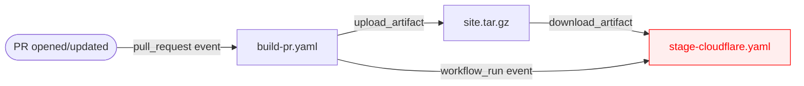
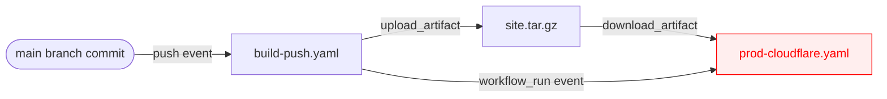
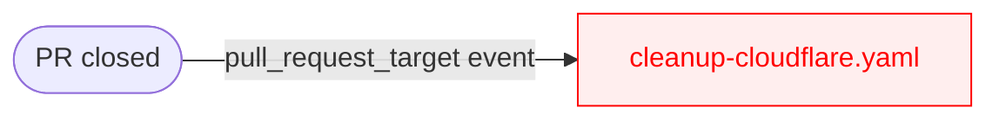

# static-site-tools

*Workflows and Actions for GitHub Actions-based building of static sites for
OMSF projects.*

This repository contains several reusable GitHub Actions workflows and actions
that facilitate deployment of static sites. This is aimed to support the
workflows used by projects at the Open Molecular Software Foundation (OMSF). In
particular, our projects had the following needs:

* Deploy static sites build with Hugo or Jekyll
* Provide preview builds of pull requests, including from forks
* Deploy to Cloudflare Pages

We decided on deploying to Cloudflare Pages because (1) it is unlikely that our
needs will go beyond the free tier, (2) it made the preview builds very easy,
and (3) it has excellent and easy-to-use user management.

Note that the requirement for preview builds of pull requests *from forks* is
one of the things that makes the tooling here a little more complicated. We
need access to secrets in order to deploy the preview site, and PRs from forks
don't have access to secrets. But as an open and transparent organization, we
wanted to encourage contributions from outsiders whenever possible.

**Contents**

* [Overview](#overview): A brief explanation of how this all works.
* [Preparing to Install](#preparing-to-install): Setting up Cloudflare and
  GitHub, before adding workflows to your website repository.
* [Installing for Hugo](#installing-for-hugo): How to install the workflows and
  actions for a Hugo-based website.
* [Installing for Jekyll](#installing-for-jekyll): How to install the
  workflows and actions for a Jekyll-based website.

## Overview

The basic idea here is that there are three kinds of workflows that we need,
which are triggered by different GitHub events:

* **Deploying a PR preview:** This happens when a pull request is opened or
  updated. We build the site according to the PR, and deploy it as a preview on
  Cloudflare. We create or update a comment on the PR that provides a link to
  the preview site.
* **Deploying a main branch build:** This happens when a commit is pushed to
  the main brain (including after merging a PR). Again, we build the site and
  deploy, although this time we create a deployment on the main site.
* **Cleaning up after a PR:** This happens when a PR is closed (including
  merged). We delete all the deployments from that branch except for the final
  one (left so that links from the comment will still be valid; potentially
  useful for tracking history.)

We also recommend a nightly build of the main branch to test with.

### Deploying a PR preview

Handling this event is split into 2 GitHub Actions Workflows. The basic idea is
that the site is built in the first workflow, which is triggered by a
`pull_request` event. The resulting HTML is stored in an artifact. When the
`build-pr` workflow has succeeded, the `stage-cloudflare` workflow is triggered
by a `workflow_run` event.  The artifact is used to communicate between the
`build-pr` and `stage-cloudflare` workflows.  The `workflow_run` event has
access to repository secrets, and is marked in red to emphasize that. It can
therefore deploy to Cloudflare. But because it operates independently of the PR
(and never even does a checkout), the only thing a malicious PR could do is
deploy the preview.

### Deploying a main branch build

The deploying to the main branch uses nearly the same pattern as for PRs,
although the deployment to production doesn't require interaction with a PR
(via comments, etc) that the staging does.

### Cleaning up after a PR

When a PR is closed (including by merge) we trigger the `cleanup-cloudflare`
workflow using the `pull_request_target` event. This workflow deletes older
deployments from the branch when the PR is closed.

## Preparing to Install

### Cloudflare

Please note that we have a [separate page](cloudflare-setup.md) documenting how
to set up Cloudflare accounts and how to set up a Cloudflare Pages project.

You'll need to get several pieces of information from Cloudflare, which you
will then add to GitHub as secrets/variables:

1. **Your Cloudflare account ID**: Find this by going to the Cloudflare
   account, clicking on "Workers and Pages" in the left sidebar. The account ID
   can be found on the right. [Cloudflare docs](https://developers.cloudflare.com/fundamentals/setup/find-account-and-zone-ids/#find-account-id-workers-and-pages)
2. **Your Cloudflare API token**: To create an API token, click on "Manage
   Account" in the left sidebar, then "Account API Tokens". Click on "Create
   Token", and use the "Edit Cloudflare Workers" template. On the next page,
   you'll need to include "All zones from an account" and select the account
   (under "Zone resources"). Then click "Continue to summary" and then "Create
   Token". [Cloudflare
   docs](https://developers.cloudflare.com/fundamentals/api/get-started/create-token/)
3. **Your Cloudflare Pages project name**: This is the name of the project you
   created in Cloudflare Pages. You'll see this on the dashboard as one of you
   applications, or on the Workers & Pages page.

### GitHub

Now that we've obtained the information from Cloudflare, we'll store it as
repository level secrets/variables in GitHub.

To set secrets, go to the repository settings, and then click on "Secrets and
Variables" in the left sidebar, then click on "Actions". Ensure that the
"Secrets" tab is selected, and click on "New repository secret". [GitHub
docs](https://docs.github.com/en/actions/security-for-github-actions/security-guides/using-secrets-in-github-actions#creating-secrets-for-a-repository)

You'll need to add two secrets:

* `CLOUDFLARE_ACCOUNT_ID`: The Cloudflare account ID you obtained above.
* `CLOUDFLARE_API_TOKEN`: The Cloudflare API token you obtained above.

Once you've added those two secrets, add the variables that will be used.
Select the "Variables" tab, and click "New repository variable" to create a new
variable. [GitHub docs](https://docs.github.com/en/actions/writing-workflows/choosing-what-your-workflow-does/store-information-in-variables#creating-configuration-variables-for-a-repository) You'll need to add the following variables:

* `MAIN_REPO`: The name of your GitHub repository, in the form `owner/repo`.
  This should be the repo that has the secrets/permissions to deploy; this is
  used to prevent errors from occurring when workflows are triggered on forks.
* (Hugo) `CLOUDFLARE_PROJECT_NAME`: The name of the Cloudflare Pages project
  you obtained above.
* (Jekyll): `CLOUDFLARE_JEKYLL_PROJECT_NAME`: The name of the Cloudflare Pages
  project you obtained above. This differs for Jekyll so that in this
  repository we can test both Hugo and Jekyll.

## Installing for Hugo

## Installing for Jekyll
